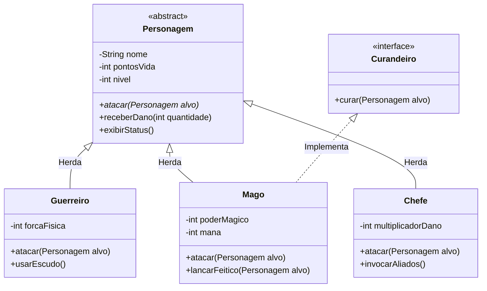

# Desafio de Arquitetura: Sistema de Batalha RPG 🗡️

**Missão:** Vocês acabam de receber a planta arquitetônica abaixo. O desafio de vocês é codificar exatamente o que está nesta planta usando Herança, Polimorfismo e Interfaces em Java.

